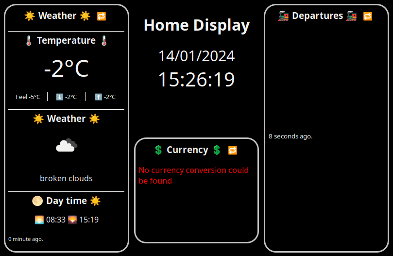

# Home Display 🏠

This project aims to provide timings for nearby bus stop, meteo information and currency information. It is intended to run on a controlled environment on a raspberry-pi.



# Organisation 🛠️
The Tauri app is used to display & interact with the results from the APIs (cached in redis).
It serves as a desktop application that displays (~in real time) the data of the different APIs.
It relies on an external redis storage to cache results.

# App 💻
Install the tauri cli to be able to run the application.
```bash
cargo install tauri-cli
```

To run the tauri application run `cargo tauri dev` from the root of the project. This will build the app and start it in development mode.
In order to be able to use the APIs directly, some variables need to be set. See the [configuration](#configuration-🛠) section for more information.

The frontend is built with rust using the [Yew](https://yew.rs) framework.

# TUI 📟
A TUI version is available for lower-end devices (e.g. raspberrypi-3b) or devices without a graphical interface.
The TUI is a simple text interface that displays the same information as the GUI. In order to build the tui,
run `cargo build --release --bin hd-tui`.


gif generated using [VHS](https://github.com/charmbracelet/vhs) (`vhs .github/tui.tape`).

# Compile for ARM 🛠️
This project is intended to run on a raspberryPi. The script `arm_comp.sh` serves to cross-compile and build a `.deb` package for raspbian from ubuntu. This is highly unstable, it is recommended (if possible) to build directly on a raspberryPI.

# APIs 🌐
* [open-meteo](https://open-meteo.com/) For weather information
* [openexchangerate](https://openexchangerates.org/) For currency conversion
* [sl.se](https://sl.se/) (through [trafiklab.se](https://www.trafiklab.se/)) For real-time transports information in Stockholm

# Configuration 🛠

In order to configure the application, the following environment variables need to be set:
```bash
export OER_API_KEY=<Your api key for openexchangerate>
export REDIS_HOST=<The host of the redis server>
export REDIS_PORT=<The port of the redis server>
```

Additionally, the following environment variables can be set to configure the location and currency conversions:

Latitude and longitude of the point to watch the weather for
```bash
export WEATHER_LAT=<latitude of the point>
export WEATHER_LON=<longitude of the point>
```

Currency conversion, from and to (Use the currency codes)
```bash
export OER_FROM=<Base currency code>  # e.g. EUR
export OER_TO=<Currency to convert to>  # e.g. SEK
```

Stop names for the bus stops to watch for
```bash
export SL_PLACE_BUS_STOPS=<stop 1>,<stop 2>,...
```

> ⚠️ Sometimes multiple stops are available for the same name. All the matches will be displayed.

# Future ideas 💡
* [ ] TUI for managing currently existing bus stops (removing, search for new ones, ...) as finding the stop IDs is tedious
* [ ] Implementation of new panels (e.g. music playing with librespot, ...)
* [ ] Integration with calendar APIs to show upcoming events and reminders
* [ ] Notifications for important updates (e.g., severe weather alerts, significant currency changes)
* [ ] Historical data tracking for weather and currency to show trends over time
* [ ] Multi-language support for the interface and notifications
